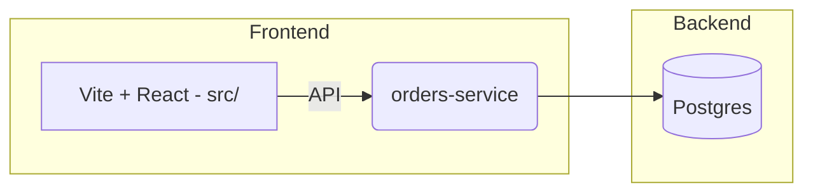

# Arquitetura e Justificativa Técnica

## Visão Geral
O sistema é dividido em 3 camadas principais:

- Frontend — Aplicação React + Vite que apresenta dashboard e formulários para criar pedidos.
- Orders Service — Microserviço HTTP (Fastify) que persiste pedidos e drones no Postgres.
- Banco de Dados — Postgres, inicializado via `infra/db/init.sql`.



## Padrões aplicados (onde estão)

- Singleton: `ControlCenter` — `src/lib/patterns/ControlCenter.ts` (gerenciamento central do estado e simulação).
- Factory: `DroneFactory` — `src/lib/patterns/Drone.ts` (cria diferentes tipos de drone).
- Strategy: `RouteStrategy` — `src/lib/patterns/RouteStrategy.ts` (algoritmos de rota).
- Observer: `Observer` — `src/lib/patterns/Observer.ts` (pub/sub in-memory para UI updates).
- Command: `Command` e implementações (TakeOff, Land, Return, Cancel) — `src/lib/patterns/Command.ts`.

Esses padrões tornam a solução modular, testável e alinhada a princípios SOLID.

## Onde estão os requisitos técnicos

- Clean Code: códigos com responsabilidades separadas em `src/lib` e `services/orders-service/src`.
- TDD: testes unitários com Vitest em `services/orders-service/test` (rotas de orders). Adicionei E2E com Playwright em `tests/e2e`.
- BDD: cenários de alto nível modelados no diretório de testes E2E (podem ser migrados para Gherkin facilmente).
- Docker: `docker-compose.yml` e `services/orders-service/Dockerfile`.

## Estratégia de Testes
- Unit tests: testar handlers e adaptadores do `orders-service` com Vitest (mock do DB via `src/db.ts`).
- E2E: Playwright testa criação de pedidos e visualização no frontend (`tests/e2e/orders.spec.ts`).

## Justificativa das escolhas

- Fastify para microserviço: leve, alta performance e plugin ecosystem (ex.: CORS) — bom para protótipos de microserviços.
- Postgres: persistência relacional simples para pedidos e consultas.
- Adapter pattern no frontend (`ordersApi`) para desacoplar chamadas HTTP da lógica de domínio (`ControlCenter`).
- Playwright para E2E: confiável para testes de UI e integração e permite rodar headless em CI.

## Deploy

Recomendo Render ou Railway para deploy rápido de containers Docker. Para publicar:

1. Buildar imagens Docker em CI e enviar para Docker Registry.
2. Criar serviço no Render apontando para a imagem ou usar `docker-compose` em um host que suporte.

Exemplo de GitHub Actions (resumo):

```yaml
# - name: Build and test
#   run: |
#     npm ci
#     npm run build
#     npm run test
```

## Documentos relacionados
- `README.md` — como rodar e mapeamento de arquivos.
